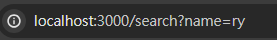

# Get

get後的數值是傳輸json，預設是空的
### 
```json
{}
```
可輸入key and vlaue 來顯示， 例如 key = name ， value = ry
### 
 ```json
 {"name":"ry"}
 ```

可以不只放一個舉例來說這邊放 name 和 age，可發現json都是字串呈現 
### 
 ```json
 {"name":"ry", "age":"18"}
 ```


